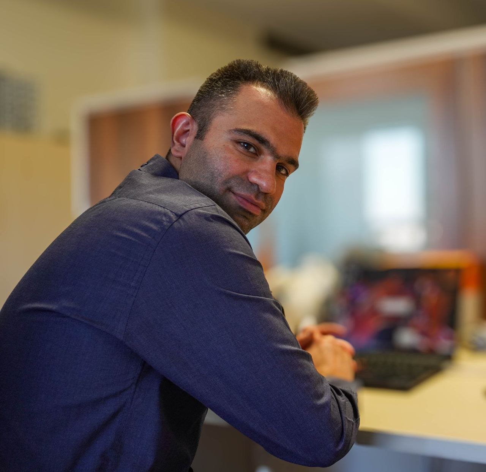

### 👋 ArashEM Github profile 👋
Hey there, I'm **Arash** Golgol. I'm an electronic engineer with special interest in **EM**bedded systems, `Linux` specifically.   
I'm also interested in hardware design (_Schematic/PCB_) and hardware design (_VHDL_)!

- 🔭 I’m currently working on 
  - [v3s](https://linux-sunxi.org/V3s) media sub systems (`mipi-csi`, `de`, ... ) 
- 🌱 I’m currently studing 
  - [Embedded Networking with CAN and CANopen](https://www.amazon.com/Embedded-Networking-CANopen-Olaf-Pfeiffer/dp/0692740872)
  - [Mastering Linux Device Driver Development](https://www.amazon.com/Mastering-Linux-Device-Driver-Development/dp/178934204X)
- 💬 Ask me about _Linux/Git/C++_
- 📫 How to reach me: arash.golgol@gmail.com
